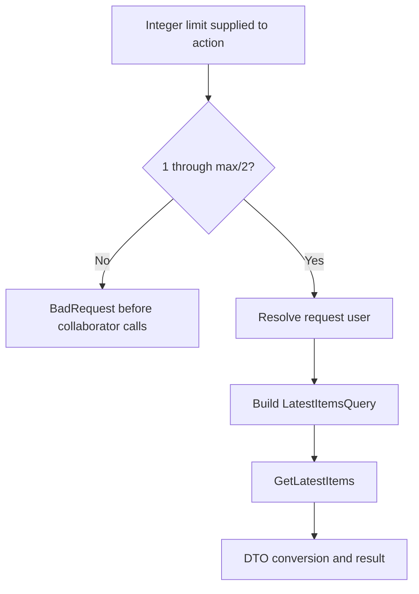

# Calculate the boundary and trace the work it prevents

The accepted mathematical interval is 1 through 1,073,741,823. Signed 32-bit maximum is 2,147,483,647; integer division by two yields 1,073,741,823. Doubling that value gives 2,147,483,646. The next integer doubles to 2,147,483,648, outside the range.

| Input | Guard decision | Reason |
|---:|---|---|
| -2,147,483,648 | Reject | Nonpositive |
| -1 | Reject | Nonpositive |
| 0 | Reject | Nonpositive |
| 1 | Accept guard | Smallest positive value |
| 20 | Accept guard | Current default |
| 1,073,741,823 | Accept guard | Largest safely doubled value |
| 1,073,741,824 | Reject | First value above the threshold |
| 2,147,483,647 | Reject | Exceeds the threshold |

“Accept guard” does not mean every request returns 200. A later user lookup can fail, and other layers can reject an HTTP request before the action runs. The table isolates one condition under the direct controller-call contract.

## Invalid request trace

Call the controller with limit 0 and no configured mock user. The guard returns `BadRequest` before `RequestHelpers.GetUserId`, user-manager lookup, library-view querying or DTO conversion. Strict mocks expose an accidental early call. A test should assert both the rejected action result and the absence of relevant collaborator calls.

Moving the same predicate below library access may preserve the final status while violating the intended work boundary. The difference can matter for cost, side effects and the ability to reject an invalid request without configuring unrelated dependencies.

## Valid request trace

Provide a known test user, parent ID, played-state filter and grouping disabled. The query should retain those choices. The current code maps a missing parent ID to `Guid.Empty`. When `isPlayed` is omitted, the user's `HidePlayedInLatest` preference can supply a false filter. Explicitly supplied `true` is a different case from omission.

An empty list from the view service still flows through DTO conversion and yields the normal successful empty result. The focused tests assert the response using an assignable `OkObjectResult` because the base controller supplies a typed subclass. Requiring exactly the base type would test an incidental construction choice instead of the response contract.

## Defaults and compatibility

The current method defaults are limit 20 and grouping true. To establish that an omitted C# argument uses the default, omit it in the call. Passing 20 explicitly would continue to pass even if the declared default changed. The compatibility route delegates to the main method and therefore shares the guard; the surrounding HTTP route and binding still need HTTP-level evidence.

Use the [worksheet](labs/README.md) to predict thresholds, call counts and forwarding before inspecting the answer guide.
